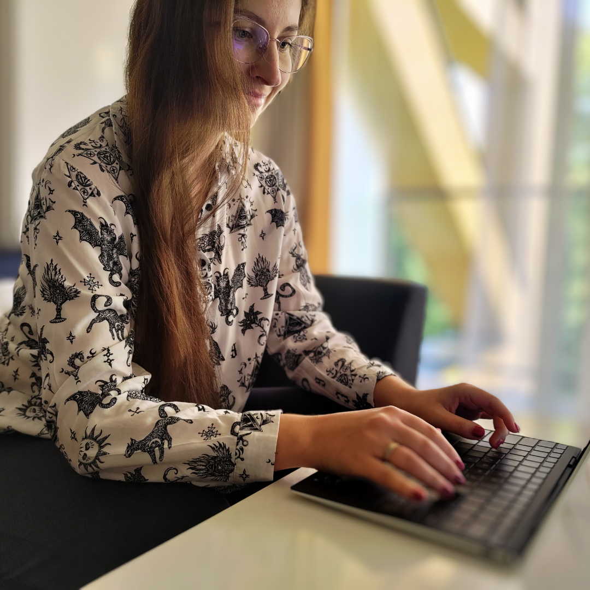
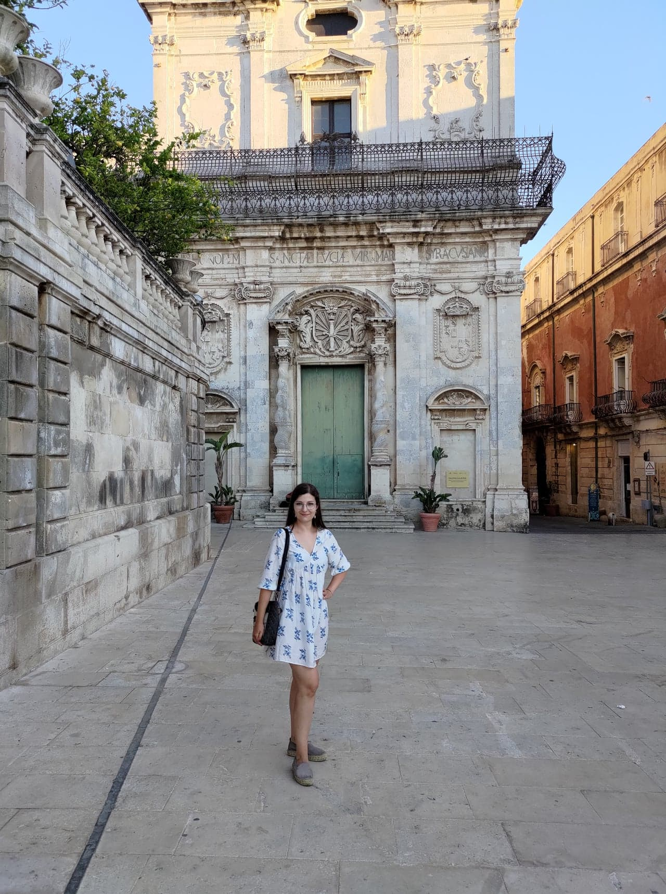

Jestem specjalistką QA, liderką zespołu, poliglotką, przyrodniczką... Najkrócej mówiąc - **multipotencjalistką w świecie IT**.

Jak się tu znalazłam?

Skończyłam biologię człowieka, specjalizując się w **psychologii ewolucyjnej** i postrzeganiu atrakcyjności. Na studiach aktywnie działałam w kołach naukowych, współorganizowałam konferencje i pracowałam przy projektach naukowych. Choć obecnie nie pracuję w zawodzie, na co dzień używam umiejętności zdobytych podczas studiów: elementów wiedzy psychologicznej, metod weryfikowania informacji, naukowego mindsetu, sceptycznego podejścia.
Mam również szeroką wiedzę na temat **neuroróżnorodności** (głównie autyzmu i ADHD), którą regularnie dzielę się jako samorzeczniczka. 

Po studiach mocno zmieniłam kierunek i dołączyłam do zespołu w korporacji z **branży IT** jako testerka. Pierwsze swoje testy pisałam... po francusku. 
Podczas mojej kariery dokonałam upskillingu w kierunku **automatyzacji testów** oraz **zarządzania testami**, dzięki czemu wiem jak trudna jest nauka umiejętności technicznych od podstaw i jakie pułapki czyhają na adeptów rozwoju w IT. Pracowałam już w 5 firmach i w około 10 projektach, co daje mi szeroką perspektywę na całą branżę i różne typy firm oraz projektów.

W pracy QA uwielbiam różnorodność: obecnie jestem tech liderką (Technical Product Owner według SAFe) małego zespołu, ale oprócz zarządzania wymaganiami biorę też udział w bieżących zadaniach testerskich, zarządzaniem incydentami (Service Management) oraz facylitowaniu spotkań.

**Języki obce** są bardzo ważne w moim życiu. Jeszcze na studiach uzyskałam certyfikat **CAE** z wynikiem ponad 80%, co oznacza **poziom C2 języka angielskiego**.
Niedługo później uzyskałam certyfikat **DALF C1 z języka francuskiego**. Znam też język włoski i podstawy kilku innych.
Na co dzień pracuję w bardzo dużym projekcie IT, w którym mam okazję używać żywego biznesowego angielskiego i poznawać praktyczne problemy związane z **komunikacją międzykulturową i zdalną**.
Pogłębianie wiedzy na ten temat i dzielenie się nią to moja pasja.

Działam aktywnie w **community IT** publikując treści na [Instagramie](https://www.instagram.com/dzikajakosc/) oraz [LinkedInie](https://www.linkedin.com/in/ameliawalter/). Powoli startuję z [YouTube](https://www.youtube.com/@DZIKAJAKOSC). Występuję też **jako prelegentka** na [różnych konferencjach](https://crossweb.pl/profile/amelia-walter-dzikowska/115016/) i podobnych eventach. Moja działalność została doceniona nominacją do [Ludzi Testowania 2024](https://testerzy.pl/news/wydarzenia/ludzie-testowania-2024-glosowanie).

Jeśli chcesz, żebym przedstawiła jedną ze swoich prezentacji albo warsztatów na Twoim meetupie, daj znać na dzikajakosc@gmail.com!

